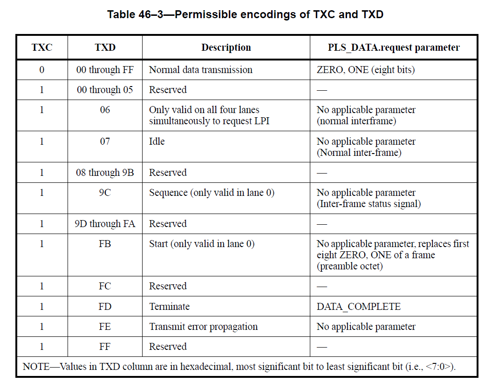
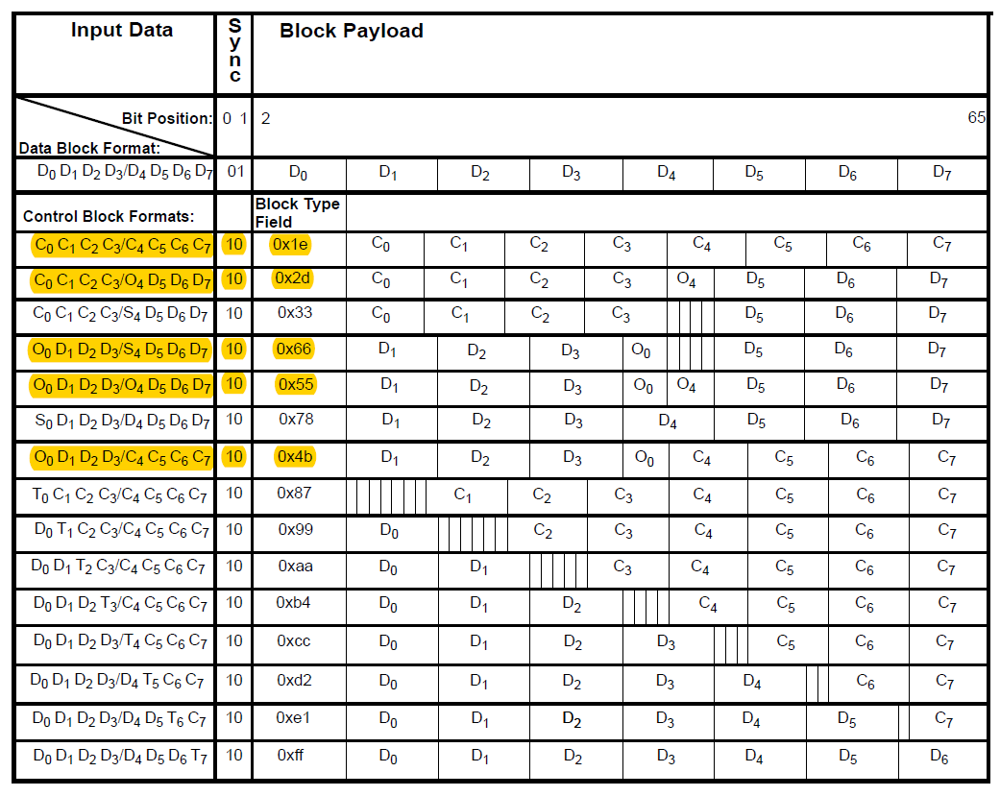

# teng_phy_xilinx

10g low latency phy for xilinx ultra-scale device

Start from normal 10g baser config: 
1, async gearbox for 64B/66B 
2, user data width & internal data width are both 32 bit 
3, enable buffer 

first step,    add xgmii interface support 
second step, add mac stream interface support 

